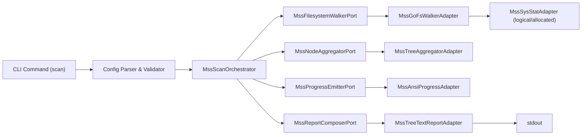

# mac-storage-scout: Спецификация и Архитектура

## 1. Vision & Primary Goal
`mac-storage-scout` — быстрый терминальный инструмент для macOS, который объясняет, куда ушло место на диске, в читаемом древовидном формате.

Primary goal: дать оператору доказуемый и компактный ответ вида "что именно занимает место", без стены текста, с едиными правилами детализации (`>= threshold` показывать явно, остальное агрегировать в `other`).

## 2. DX & Quick Start (Target Language: Go)

```bash
# Build a tiny single-binary CLI
cd /Users/k.lebedev/Developer/mac-storage-scout
go build -o ./bin/mss ./cmd/mss

# Scan key macOS paths with default threshold 500MB
./bin/mss scan \
  --threshold 500MB \
  --top 5 \
  --profile macos-core

# Same scan using allocated blocks (inode-reported)
./bin/mss scan \
  --threshold 500MB \
  --size-mode allocated \
  --profile macos-core

# Same scan in plain ASCII mode (no emoji glyphs)
./bin/mss scan \
  --threshold 500MB \
  --top 5 \
  --plain \
  --profile macos-core
```

```text
# Intent: highlight every item >= threshold, aggregate smaller ones.
[~/Library/Application Support] 22.7GB
├─ MobileSync .............................................. 7.1GB
├─ Google .................................................. 5.4GB
└─ other (<500MB each, 132044 items) ...................... 10.2GB
    top-5:
    Code ................................................... 0.48GB
    Steam .................................................. 0.44GB
    ...
    rest (132039 items) .................................... 9.28GB
    types:
    .db .................................................... 1.1GB (2304 files)
    .json .................................................. 0.8GB (24119 files)
    rest types ............................................. 8.3GB (105621 files)
```

```bash
# Intent: stream progress in live terminal while scanning.
./bin/mss scan --threshold 500MB --progress
# progress line example:
# scanned: dirs=18421 files=392114 bytes=216.4GB queue=287 errors=14 elapsed=00:01:12
```

## 3. High-Level Architecture



Main flow:
1. CLI валидирует флаги и собирает scan-plan (пути, threshold, topN, size mode).
2. Оркестратор запускает bounded worker-pool обхода директорий.
3. Агрегатор получает streaming events и считает дерево размеров.
4. Прогресс-адаптер рендерит live status (TTY-aware).
5. Report composer печатает единый формат (large items + `other/top-5/rest/types`).

## 4. Assumptions & Constraints (Context for DbC)
- **Business Rules & Constraints:**
  - Все элементы `>= threshold` обязаны выводиться явно.
  - Все элементы `< threshold` обязаны попадать в `other`.
  - Для каждого `other` обязателен одинаковый формат: `top-5`, `rest`, `types`.
  - По умолчанию threshold = `500MB`; флагом можно менять.
  - По умолчанию size-mode = `logical` (`st_size`); альтернативно `allocated` (`st_blocks*512`).
  - Инструмент работает best-effort на живой системе и не прерывается на `EPERM/EACCES/ENOENT`.
- **Trade-offs:**
  - Нет полной APFS-атрибуции clone/snapshot space по путям в v1 (это ограничение syscall-level наблюдаемости).
  - Выбран streaming aggregation вместо полной materialization дерева файлов для скорости и памяти.
- **YAGNI & Anti-Overengineering Decisions:**
  - Нет GUI, нет daemon mode, нет background indexer в v1.
  - Нет plug-in system и удаленных exporters.
  - Нет полной интерактивной TUI; только компактный ANSI progress + финальный отчёт.
- **Security & Trust Boundaries:**
  - Канонический источник данных: локальная FS через `os.ReadDir`/`lstat`/`stat`.
  - Инструмент не читает содержимое файлов, только metadata.
  - Симлинки по умолчанию не следуются.
- **Runtime Fidelity & Deferred Scope:**
  - Real runtime integration: реальный обход live filesystem.
  - Simulation/test seam: синтетические test fixtures для unit/integration тестов.
  - Deferred runtime scope: APFS snapshots/purgeable глубокая атрибуция по пути.
- **Open Risks & Validation Needs:**
  - Риск лишних syscalls на больших деревьях -> проверяется benchmark-профилем.
  - Риск overcount в allocated mode на APFS clones -> явная маркировка как estimate.
  - Риск шумного progress в non-TTY -> fallback на final-only output.
- **Supporting Artifacts & Handoff Map:**
  - `spec/mac-storage-scout.macos-performance.reference.md` — нормативный reference по macOS/APFS size semantics и performance decisions.
  - `spec/mac-storage-scout.output-format.source-of-truth.md` — нормативный source-of-truth по формату отчёта.
  - Root artifact (primary input for dbc-contract-gen): `spec/mac-storage-scout.spec.md`.

## 5. Domain Contracts (DbC)

### Ports

#### Port: MssScanOrchestratorPort
- **Type:** Port (Interface)
- **Purpose:** Оркестрировать полный scan lifecycle (config -> walk -> aggregate -> render).
- **Consumer:**
  - Internal: `cmd/mss/main.go`
- **Supporting Artifacts:**
  - `spec/mac-storage-scout.macos-performance.reference.md`
  - `spec/mac-storage-scout.output-format.source-of-truth.md`
- **Verification Surface:** `runtime-hook-required`
- **Deferred Runtime Scope:** snapshot/purgeable attribution by path.
- **Contract (DbC):**
  - Preconditions:
    - At least one root path exists and is readable or partially readable.
    - `thresholdBytes > 0`.
    - `topN >= 1`.
  - Postconditions:
    - Produces one final report for each requested root/section.
    - Emits non-fatal error summary for skipped paths.
  - Invariants:
    - Any item with size `>= threshold` is explicit in output.
    - Any item with size `< threshold` is included only inside `other`.

#### Port: MssFilesystemWalkerPort
- **Type:** Port (Interface)
- **Purpose:** Высокопроизводительный обход файловой системы и emission metadata events.
- **Consumer:**
  - Internal: `internal/mss/app/mss_scan_orchestrator.go`
- **Supporting Artifacts:**
  - `spec/mac-storage-scout.macos-performance.reference.md`
- **Verification Surface:** `runtime-hook-required`
- **Deferred Runtime Scope:** None.
- **Contract (DbC):**
  - Preconditions:
    - Worker count bounded (`1..64`).
    - Paths normalized to absolute.
  - Postconditions:
    - Every discovered entry emits exactly one event or one error record.
    - Traversal terminates when queue is drained and workers joined.
  - Invariants:
    - Default mode does not follow symlinks.
    - Permission/race errors are counted and do not abort whole scan.

#### Port: MssNodeAggregatorPort
- **Type:** Port (Interface)
- **Purpose:** Построить и агрегировать дерево размеров для отчёта.
- **Consumer:**
  - Internal: `internal/mss/app/mss_scan_orchestrator.go`
- **Supporting Artifacts:**
  - `spec/mac-storage-scout.output-format.source-of-truth.md`
- **Verification Surface:** `contract-only`
- **Deferred Runtime Scope:** None.
- **Contract (DbC):**
  - Preconditions:
    - Input events contain path, kind, size.
  - Postconditions:
    - Root totals equal sum(largeItems + otherBucket).
    - Stable sorting by size desc for visible items.
  - Invariants:
    - `other` contains only `< threshold` items.

#### Port: MssReportComposerPort
- **Type:** Port (Interface)
- **Purpose:** Сериализовать агрегированное дерево в читаемый ASCII report.
- **Consumer:**
  - Internal: `cmd/mss/main.go`
- **Supporting Artifacts:**
  - `spec/mac-storage-scout.output-format.source-of-truth.md`
- **Verification Surface:** `contract-only`
- **Deferred Runtime Scope:** None.
- **Contract (DbC):**
  - Preconditions:
    - Aggregated tree is consistent.
  - Postconditions:
    - Output follows exact `large + other/top-5/rest/types` structure.
  - Invariants:
    - Same layout rules for all sections.

#### Port: MssProgressEmitterPort
- **Type:** Port (Interface)
- **Purpose:** Отображать live progress без блокировки hot path.
- **Consumer:**
  - Internal: `internal/mss/app/mss_scan_orchestrator.go`
- **Supporting Artifacts:**
  - `spec/mac-storage-scout.macos-performance.reference.md`
- **Verification Surface:** `simulation-backed`
- **Deferred Runtime Scope:** advanced multi-line adaptive TUI.
- **Contract (DbC):**
  - Preconditions:
    - Progress stats are monotonic counters.
  - Postconditions:
    - In TTY mode, status refreshed periodically.
    - In non-TTY mode, progress is suppressed or reduced.
  - Invariants:
    - Rendering never blocks traversal workers.

### Adapters

#### Adapter: MssGoFsWalkerAdapter
- **Type:** Adapter (Implementation)
- **Purpose:** Реализация MssFilesystemWalkerPort через `os.ReadDir` + `lstat/stat`.
- **Implements:** `MssFilesystemWalkerPort` (`internal/mss/ports/mss_filesystem_walker_port.go`)
- **Supporting Artifacts:**
  - `spec/mac-storage-scout.macos-performance.reference.md`
- **Verification Surface:** `runtime-hook-required`
- **Side Effects:** filesystem metadata reads; permission-denied events.

#### Adapter: MssSysStatAdapter
- **Type:** Adapter (Implementation)
- **Purpose:** Извлечение logical/allocated size из `syscall.Stat_t`.
- **Implements:** stat utility used by `MssGoFsWalkerAdapter`.
- **Supporting Artifacts:**
  - `spec/mac-storage-scout.macos-performance.reference.md`
- **Verification Surface:** `runtime-hook-required`
- **Deferred Runtime Scope:** clone-aware physical ownership (not representable via plain stat).

#### Adapter: MssTreeAggregatorAdapter
- **Type:** Adapter (Implementation)
- **Purpose:** Реализация MssNodeAggregatorPort; расчёт `other`, `top-5`, `types`.
- **Implements:** `MssNodeAggregatorPort` (`internal/mss/ports/mss_node_aggregator_port.go`)
- **Supporting Artifacts:**
  - `spec/mac-storage-scout.output-format.source-of-truth.md`
- **Verification Surface:** `contract-only`
- **Side Effects:** in-memory aggregation.

#### Adapter: MssAnsiProgressAdapter
- **Type:** Adapter (Implementation)
- **Purpose:** TTY-aware ANSI progress renderer.
- **Implements:** `MssProgressEmitterPort` (`internal/mss/ports/mss_progress_emitter_port.go`)
- **Supporting Artifacts:**
  - `spec/mac-storage-scout.macos-performance.reference.md`
- **Verification Surface:** `simulation-backed`
- **Deferred Runtime Scope:** richer curses-like UI.

#### Adapter: MssTreeTextReportAdapter
- **Type:** Adapter (Implementation)
- **Purpose:** Финальный ASCII-отчёт для stdout.
- **Implements:** `MssReportComposerPort` (`internal/mss/ports/mss_report_composer_port.go`)
- **Supporting Artifacts:**
  - `spec/mac-storage-scout.output-format.source-of-truth.md`
- **Verification Surface:** `contract-only`
- **Side Effects:** stdout output.

## 6. File Structure & Component Mapping

```text
mac-storage-scout/
├─ cmd/
│  └─ mss/
│     └─ main.go
├─ internal/
│  └─ mss/
│     ├─ app/
│     │  └─ mss_scan_orchestrator.go
│     ├─ domain/
│     │  ├─ mss_types.go
│     │  ├─ mss_threshold.go
│     │  └─ mss_format.go
│     ├─ ports/
│     │  ├─ mss_scan_orchestrator_port.go
│     │  ├─ mss_filesystem_walker_port.go
│     │  ├─ mss_node_aggregator_port.go
│     │  ├─ mss_report_composer_port.go
│     │  └─ mss_progress_emitter_port.go
│     └─ adapters/
│        ├─ fs/
│        │  ├─ mss_go_fs_walker_adapter.go
│        │  └─ mss_sys_stat_adapter.go
│        ├─ aggregate/
│        │  └─ mss_tree_aggregator_adapter.go
│        ├─ progress/
│        │  └─ mss_ansi_progress_adapter.go
│        └─ report/
│           └─ mss_tree_text_report_adapter.go
├─ spec/
│  ├─ mac-storage-scout.spec.md
│  ├─ mac-storage-scout.macos-performance.reference.md
│  ├─ mac-storage-scout.output-format.source-of-truth.md
│  ├─ README.md
│  └─ tasks/
│     └─ mac-storage-scout.task-*.md
└─ go.mod
```

**File Mapping:**
- `cmd/mss/main.go`: CLI entrypoint, flags parsing, wire-up of adapters.
- `internal/mss/app/mss_scan_orchestrator.go`: orchestration flow and lifecycle.
- `internal/mss/ports/*.go`: strict contracts for scanner/aggregator/progress/report.
- `internal/mss/adapters/fs/*.go`: runtime filesystem integration.
- `internal/mss/adapters/aggregate/*.go`: threshold/other/top-5 aggregation logic.
- `internal/mss/adapters/progress/*.go`: live terminal progress rendering.
- `internal/mss/adapters/report/*.go`: final ASCII tree output formatter.


## 8. Decision Summary (Root-Level)

Purpose: store concise cross-task lessons here; keep detailed chronology inside each task spec (`spec/tasks/*.md`, section `Execution Log (AI-to-AI)`).

### Valid Decisions
- D-001: Threshold contract (`>= threshold` explicit, `< threshold` in `other`) is correct and should remain invariant.
  - implemented_in: `TSK-03`, `TSK-04`
- D-002: Standardized `other` block (`top-N`, `rest`, `types`) across all sections improves comparability and readability.
  - implemented_in: `TSK-04`
- D-003: Safe-delete workflow (`--dry-run` before `--yes`, protected-path guards) is mandatory.
  - implemented_in: `TSK-05`
- D-004: Profile `macos-core` target paths are practical for real macOS disk investigations.
  - implemented_in: `TSK-05`
- D-005: Repository-wide autonomous Go coding/testing rules are centralized under `.ai` and mandatory for bootstrap.
  - implemented_in: `TSK-06`
- D-006: Contract comments and non-trivial control-flow anchors are enforced for runtime-critical modules.
  - implemented_in: `TSK-06`

### Invalid / Reverted Decisions
- R-001: Separate global action log file as primary chronology (`spec/ACTION-LOG.md`) caused duplication and drift risk.
  - resolution: use task-local Execution Logs as primary chronology; keep root spec only for decision summaries.
  - applied_in: `TSK-05` documentation update

### Documentation Policy
- Root spec: decision-level summary only.
- Task specs: detailed step-by-step execution logs and verification timeline.

## 7. Dev Agent Implementation Rules
0. Before code changes, load `.ai` rule set:
   - `.ai/rules/go-devgen.contracts.md`
   - `.ai/rules/go-qa.testing.md`
   - `.ai/checklists/go-change-checklist.md`
   - `.ai/checklists/go-test-checklist.md`
1. Для каждого adapter-level типа добавлять doc-comment с trace:
   - `@implements {PortName} <path/to/port.file>`
2. Для методов, реализующих контракт без изменения семантики, использовать `@see {PortName#MethodName} <path/to/port.file>`.
3. Если метод меняет/расширяет поведение контракта, описывать новый контракт явно в comment block.
   - For non-trivial logic prefer machine tags: `@purpose`, `@pre`, `@post`, `@invariant`.
   - For non-trivial control flow use intent anchors: `START_...` / `END_...`.
4. Namespace discipline:
   - ключевые типы/файлы используют префикс `mss_` / `Mss...`.
5. Platform/runtime-specific implementations обязаны ссылаться на supporting artifact в class/file comment.
6. Если реализация `simulation-backed`, маркировать это явно и не выдавать за full runtime integration.
7. Если публичная опция из spec не реализована в v1, фиксировать как explicit deferred scope.
8. Любая новая абстракция (новый Port/layer) допустима только с v1-justification и указанным consumer.
9. For every newly created implementation/test file in ticket execution, include file header:
   - `// @task <relative/path/to/task.md>`
   - `// @purpose <short-english-ai-to-ai-purpose>`

## 8. Acceptance Criteria
- CLI prints a readable tree where all items `>= threshold` are explicit.
- Every `other` block follows a single format across all sections:
  - `other (<threshold each, N items) ... total`
  - `top-5`
  - `rest`
  - `types` with counts.
- Default profile `macos-core` includes:
  - `~/Library/Containers`
  - `~/Library/Application Support`
  - `/private/var/vm`
  - `/private/var/folders`
- Default size mode is `logical`; `--size-mode allocated` is supported and labeled as estimate.
- Tool shows live progress in TTY and completes without abort on common permission errors.
- Tool compiles to a single binary via `go build` and has no required runtime dependencies.
- For a synthetic fixture tree, output passes deterministic golden checks.
